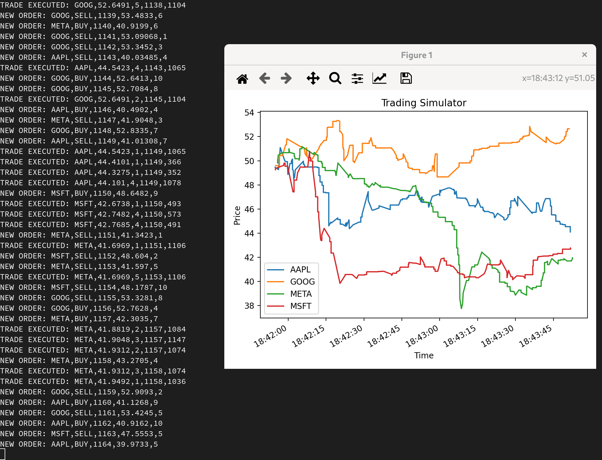

# Trading Simulator

This project is a simulator for a trading system, consisting of an exchange's matching engine, automated trading bots and real time plotter of (fake) market data.

Written in C++20 and Python.

# Dependencies

dnf install cmake gcc python3-pandas

# Building

mkdir build
cmake --build build
